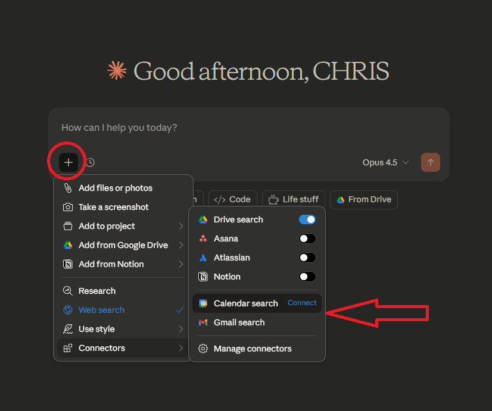
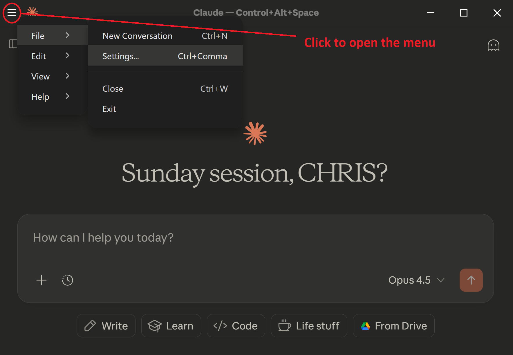
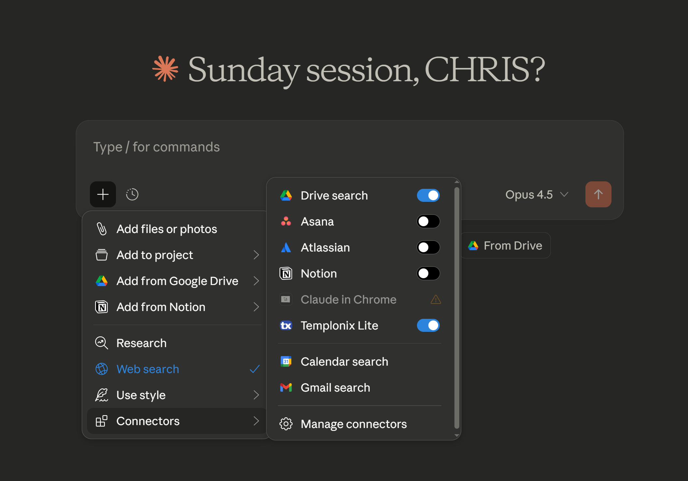
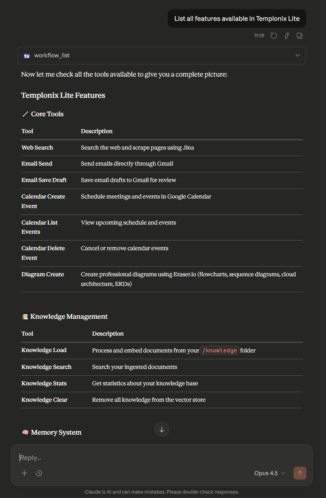

<p align="center">
  
</p>

<p align="center">
  <i>The Local-First Personal AI Agent Infrastructure</i>
</p>

Welcome to Templonix Lite, a powerful and streamlined toolkit for enhancing your experience of using Claude Desktop. It exposes a suite of tools—including Google services, web scraping, local memory, knowledge upload and dynamic workflows—through the Model-Context-Protocol (MCP), allowing Claude to perform complex, real-world tasks agentic tasks.

This guide provides all the necessary steps to get the project up and running on Windows or Mac.

## Architecture Overview

Templonix Lite acts as a custom MCP server that extends the capabilities of Claude that communicates with the MCP Protocol Layer, which can route requests to either native MCP servers (like Asana or Google Drive) or to your custom Templonix server.

<p align="center">
  
</p>

This architecture allows the agent to seamlessly access a wide range of tools, from standard SaaS products to the specialized capabilities built into this project.

---

## 🎯 Choose Your Path

Templonix Lite is designed for two types of users:

| **Standard User** | **Advanced User** |
|-------------------|-------------------|
| Want powerful AI workflows without coding | Comfortable with APIs, Google Console, and customisation |
| Use local memory + knowledge base | All Standard features PLUS email/calendar write access |
| Leverage Claude's native tools (diagrams, docs, etc.) | Add Jina web scraping, Eraser diagrams, custom tools |
| Connect via Claude's built-in SaaS integrations | Build your own MCP tools |
| **Setup time: ~15 minutes** | **Setup time: ~30 minutes** |

---

## ✨ What You Get

### For Everyone (Standard Setup)

- **🧠 Local Vector Memory (FAISS)** — Store and recall information across conversations. Use `/remember` to save facts; ask "what did I tell you about X?" to retrieve them.
- **📚 Knowledge Base Loader** — Drop documents into a folder and Templonix automatically indexes them for semantic search.
- **🔄 Dynamic Workflows** — Load expert "personas" (Sales Negotiator, Marketing Expert, etc.) that give Claude specialised knowledge and methodologies.
- **🔌 Native Claude Tools** — Use Claude's built-in abilities: create Mermaid diagrams, Word documents (.docx), PowerPoint (.pptx), and more.
- **🔗 Native SaaS Connectors** — Connect Google Drive, Gmail (read), Calendar (read), Asana, Notion, and more through Claude's official integrations.

### For Advanced Users (Additional Setup Required)

- **📅 Calendar Write Access** — Create, update, and delete Google Calendar events via the Google Calendar API.
- **📧 Email Drafts & Sending** — Create Gmail drafts or send emails directly (via Gmail API or SMTP).
- **🌐 Jina AI Web Scraping** — Reliably scrape web pages, bypassing common bot-detection and proxy issues. Requires purchase of tokens at [Jina AI website](https://jina.ai/). 
- **📊 Eraser.io Diagrams** — Generate flowcharts, sequence diagrams, and architecture diagrams from text instructions. Requires purchase of credits at [Eraser.io](https://eraser.io/). 
- **🛠️ Extensible Architecture** — Build your own MCP tools using the provided framework.

---

## 🚀 Standard Setup (~15 minutes)

Choose your operating system:

- [Windows Setup](#windows-setup)
- [Mac Setup](#mac-setup)

---

##  Windows Setup

### Prerequisites

Before you begin, ensure you have:

- **Windows 10 or 11**
- **Python 3.10, 3.11, 3.12, or 3.13** — [Download from python.org](https://www.python.org/downloads/)
- **Claude Desktop** — [Download from Anthropic](https://claude.ai/download)
- **Google Connectors Configured** — In Claude Desktop, connect your Google account for **Gmail** and **Google Calendar**. This enables read-only access to your emails and calendar events through Claude's native integrations. 
- 

> **Note:** You do NOT need Git installed. We'll download the code as a ZIP file.

---

### Step 1: Create the Project Folder

Create this exact folder path on your computer:

```
C:\Development\Templonix_Lite
```

You can do this by:
1. Open File Explorer
2. Navigate to `C:\`
3. Create a new folder called `Development`
4. Inside `Development`, create a folder called `Templonix_Lite`

---

### Step 2: Download and Extract the Code

1. Go to the [Templonix Lite GitHub page](https://github.com/0xCJT/templonix-lite)
2. Click the green **Code** button → **Download ZIP**
3. Open the downloaded `templonix-lite-master.zip`
4. Inside the ZIP, you'll see a folder called `templonix-lite-master`
5. **Copy all the contents** (files and folders) from inside `templonix-lite-master` into `C:\Development\Templonix_Lite`

Your folder should now look like this:

```
C:\Development\Templonix_Lite\
├── assets\
├── config\
├── core\
├── infra\
├── templonix_mcp\
├── tests\
├── workflows\
├── bootstrap.ps1
├── bootstrap.sh
├── requirements.txt
├── README.md
└── ... (other files)
```

---

### Step 3: Run the Bootstrap Script

This installs all the required dependencies.

1. Open **PowerShell**:
   - Press `Win + X` and select "Windows PowerShell" or "Terminal"
   - Or search for "PowerShell" in the Start menu

2. Navigate to the project folder:
   ```powershell
   cd C:\Development\Templonix_Lite
   ```

3. Run the bootstrap script:
   ```powershell
   .\bootstrap.ps1
   ```

4. Wait for it to complete (3-5 minutes). You should see "Bootstrap complete. Ready to use Templonix Lite!"

> **⚠️ If you get a "scripts disabled" error:**
> 
> Run this command first, then try again:
> ```powershell
> Set-ExecutionPolicy -ExecutionPolicy RemoteSigned -Scope CurrentUser
> ```
> Type `Y` when prompted.

---

### Step 4: Build and Install the Extension

#### 4a. Create Your Manifest File

The manifest file tells Claude Desktop how to run Templonix Lite. We've provided templates for Windows and Mac—you just need to copy the right one.

1. Open File Explorer and navigate to `C:\Development\Templonix_Lite\templonix_mcp`
2. You'll see two example files:
   - `mcp.windows.example.json` ← **Use this one**
   - `mcp.mac.example.json`
3. **Copy** `mcp.windows.example.json` and **rename the copy** to `manifest.json`

Your folder should now contain:
```
templonix_mcp/
├── manifest.json                    ← Your manifest (copied from Windows example)
├── mcp.windows.example.json
├── mcp.mac.example.json
├── app.py
└── ...
```

**Optional: Personalise it!** Open `manifest.json` in Notepad and change:
- `"display_name"` — What appears in Claude Desktop (e.g., "My AI Assistant")
- `"author": { "name": "..." }` — Put your own name
- `"description"` — Your own description

Save the file after making any changes.

#### 4b. Build the Extension Package

1. Open **PowerShell**
2. Navigate to the templonix_mcp folder:
   ```powershell
   cd C:\Development\Templonix_Lite\templonix_mcp
   ```
3. Run the pack command:
   ```powershell
   mcpb pack
   ```

This creates `templonix_mcp.mcpb` in the folder.

> **Why build it yourself?** This ensures transparency—you can inspect the `manifest.json` configuration and know exactly what's being installed. No mystery binary files!

#### 4c. Install in Claude Desktop

1. Open **Claude Desktop**
2. Click **File** → **Settings**

   

3. Go to **Advanced Settings** under Extensions
4. Scroll down and click **Install Extension**
5. Navigate to `C:\Development\Templonix_Lite\templonix_mcp`
6. Select the file `templonix_mcp.mcpb` (the one you just created)
7. Click **Confirm** to install
8. **Restart Claude Desktop**

---

### Step 5: Auto-Start on Boot (Optional but Recommended)

This makes Templonix Lite start automatically when Windows starts.

1. Press `Win + R` to open the Run dialog
2. Type `shell:startup` and press Enter
3. Copy the file `C:\Development\Templonix_Lite\config\start-templonix-silent.vbs` into this Startup folder

That's it! Templonix Lite will now run silently in the background whenever you start your computer.

---

### ✅ Windows Setup Complete!

Open Claude Desktop, click on the + symbol and see if the Templonix Lite extension is enabled. 



Then ask Claude to tell you about the available tools. 



---

##  Mac Setup

### Prerequisites

Before you begin, ensure you have:

- **macOS 11 (Big Sur) or later**
- **Python 3.10, 3.11, 3.12, or 3.13** — [Download from python.org](https://www.python.org/downloads/)
  - ⚠️ Python 3.14+ is NOT supported (many dependencies don't have compatible builds yet)
  - Check your version: `python3 --version`
- **Claude Desktop** — [Download from Anthropic](https://claude.ai/download)
- **Google Connectors Configured** — In Claude Desktop, connect your Google account for **Gmail** and **Google Calendar**. This enables read-only access to your emails and calendar events through Claude's native integrations. 
- 

> **Note:** You do NOT need Git installed. We'll download the code as a ZIP file.

---

### Step 1: Create the Project Folder

Create this folder path on your computer:

```
~/Development/Templonix_Lite
```

You can do this by:

**Option A: Using Finder**
1. Open Finder
2. Press `Cmd + Shift + H` to go to your Home folder
3. Create a new folder called `Development`
4. Inside `Development`, create a folder called `Templonix_Lite`

**Option B: Using Terminal**
```bash
mkdir -p ~/Development/Templonix_Lite
```

---

### Step 2: Download and Extract the Code

1. Go to the [Templonix Lite GitHub page](https://github.com/0xCJT/templonix-lite)
2. Click the green **Code** button → **Download ZIP**
3. Open the downloaded `templonix-lite-master.zip` (it may auto-extract to your Downloads folder)
4. Inside the extracted folder, you'll see a folder called `templonix-lite-master`
5. **Copy all the contents** (files and folders) from inside `templonix-lite-master` into `~/Development/Templonix_Lite`

Your folder should now look like this:

```
~/Development/Templonix_Lite/
├── assets/
├── config/
├── core/
├── infra/
├── templonix_mcp/
├── tests/
├── workflows/
├── bootstrap.ps1
├── bootstrap.sh
├── requirements.txt
├── README.md
└── ... (other files)
```

---

### Step 3: Run the Bootstrap Script

This installs all the required dependencies.

1. Open **Terminal**:
   - Press `Cmd + Space`, type "Terminal", and press Enter
   - Or find it in Applications → Utilities → Terminal

2. Navigate to the project folder:
   ```bash
   cd ~/Development/Templonix_Lite
   ```

3. Make the bootstrap script executable (one-time only):
   ```bash
   chmod +x bootstrap.sh
   ```

4. Run the bootstrap script:
   ```bash
   ./bootstrap.sh
   ```

5. Wait for it to complete (3-5 minutes). You should see "Bootstrap complete. Ready to build Templonix."

> **⚠️ If you get a "permission denied" error:**
> 
> Make sure you ran the `chmod +x bootstrap.sh` command in step 3.

> **⚠️ If you get "python: command not found":**
> 
> On Mac, Python 3 is often called `python3`. Edit the `bootstrap.sh` file and change `python` to `python3`, then run again.

---

### Step 4: Build and Install the Extension

#### 4a. Create Your Manifest File

The manifest file tells Claude Desktop how to run Templonix Lite. We've provided templates for Windows and Mac—you just need to copy the right one.

1. Open Finder and navigate to `~/Development/Templonix_Lite/templonix_mcp`
2. You'll see two example files:
   - `mcp.windows.example.json`
   - `mcp.mac.example.json` ← **Use this one**
3. **Copy** `mcp.mac.example.json` and **rename the copy** to `manifest.json`

**Or via Terminal:**
```bash
cd ~/Development/Templonix_Lite/templonix_mcp
cp mcp.mac.example.json manifest.json
```

Your folder should now contain:
```
templonix_mcp/
├── manifest.json                    ← Your manifest (copied from Mac example)
├── mcp.windows.example.json
├── mcp.mac.example.json
├── app.py
└── ...
```

**Important:** Open `manifest.json` in a text editor (TextEdit or VS Code) and replace `USERNAME` with your actual Mac username. 

To find your username, open Terminal and type `whoami`.

For example, if your username is `sarah`, change:
```json
"/Users/USERNAME/Development/Templonix_Lite/.venv/bin/python"
```
to:
```json
"/Users/sarah/Development/Templonix_Lite/.venv/bin/python"
```

**Optional: Personalise it!** While editing, you can also change:
- `"display_name"` — What appears in Claude Desktop (e.g., "My AI Assistant")
- `"author": { "name": "..." }` — Put your own name
- `"description"` — Your own description

Save the file after making changes.

#### 4b. Build the Extension Package

1. Open **Terminal**
2. Navigate to the templonix_mcp folder:
   ```bash
   cd ~/Development/Templonix_Lite/templonix_mcp
   ```
3. Run the pack command:
   ```bash
   mcpb pack
   ```

This creates `templonix_mcp.mcpb` in the folder.

> **Why build it yourself?** This ensures transparency—you can inspect the `manifest.json` configuration and know exactly what's being installed. No mystery binary files!

#### 4c. Install in Claude Desktop

1. Open **Claude Desktop**

   

2. Click **Claude** (menu bar) → **Settings** (or press `Cmd + ,`)
3. Go to **Advanced Settings** under Extensions
4. Scroll down and click **Install Extension**
5. Navigate to `~/Development/Templonix_Lite/templonix_mcp`
6. Select the file `templonix_mcp.mcpb` (the one you just created)
7. Click **Confirm** to install
8. **Restart Claude Desktop**

---

### Step 5: Auto-Start on Login (Optional)

There are two options for auto-starting Templonix Lite on Mac:

#### Option A: Double-Clickable Launcher (Easiest)

Use the provided `start-templonix.command` file to manually start Templonix when needed:

1. In Finder, navigate to `~/Development/Templonix_Lite/config`
2. Double-click `start-templonix.command`
3. If you see a security warning, go to **System Preferences** → **Security & Privacy** → click **Open Anyway**

You can add this file to your Dock for easy access.

#### Option B: Automatic Start on Login (LaunchAgent)

To have Templonix start automatically when you log in:

1. Open Terminal and run:
   ```bash
   cp ~/Development/Templonix_Lite/config/com.templonix.lite.plist ~/Library/LaunchAgents/
   ```

2. Load the LaunchAgent:
   ```bash
   launchctl load ~/Library/LaunchAgents/com.templonix.lite.plist
   ```

To stop auto-starting later:
```bash
launchctl unload ~/Library/LaunchAgents/com.templonix.lite.plist
rm ~/Library/LaunchAgents/com.templonix.lite.plist
```

---

### ✅ Mac Setup Complete!

Open Claude Desktop, click on the + symbol and see if the Templonix Lite extension is enabled. 


Then ask Claude to tell you about the available tools. 


---

## 🎉 You're Done!

Open Claude Desktop and try these commands:

| Try This | What Happens |
|----------|--------------|
| "List available workflows" | See what expert modes are available |
| "Load sales_negotiator workflow" | Activate the Sales Negotiator expert |
| "/remember I prefer formal communication" | Store a preference in local memory |
| "What did I tell you about communication?" | Retrieve your stored memory |

---

## 🔧 Advanced Setup

> **This section is for users who want email/calendar write access, web scraping, or diagram generation. Works on both Windows and Mac.**

### 1. Google APIs (Calendar & Gmail Write Access)

This enables creating calendar events and drafting/sending emails directly from Claude. Requires Google Cloud Console configuration.

<details>
<summary><strong>📋 Click to expand Google API setup instructions</strong></summary>

#### Prerequisites
- A Google account
- Access to [Google Cloud Console](https://console.cloud.google.com/)

#### Step 1: Create a Google Cloud Project

1. Go to [Google Cloud Console](https://console.cloud.google.com/)
2. Click **Select a project** → **New Project**
3. Name it (e.g., `Templonix-Lite`) and click **Create**
4. Select the project once created

#### Step 2: Enable APIs

1. Search for **API Library** in the console
2. Search and **Enable** these APIs:
   - **Google Calendar API**
   - **Gmail API**

#### Step 3: Configure OAuth Consent Screen

1. Go to **APIs & Services** → **OAuth consent screen**
2. Select **External** and complete the form:
   - App name: `Templonix-Lite`
   - User support email: Your email
   - Contact email: Your email
3. Click **Create**

#### Step 4: Add Test Users

1. In OAuth consent screen, go to **Audience**
2. Under **Test users**, add your email address
3. Save

#### Step 5: Create OAuth Credentials

**For Calendar:**
1. Go to **APIs & Services** → **Credentials**
2. **+ Create Credentials** → **OAuth client ID**
3. Application type: **Desktop app**
4. Name: `Templonix-Calendar`
5. Download JSON and save as `credentials.json` in your Templonix folder:
   - Windows: `C:\Development\Templonix_Lite`
   - Mac: `~/Development/Templonix_Lite`

**For Gmail:**
1. Repeat the above steps
2. Name: `Templonix-Gmail`
3. Download JSON and save as `credentials_gmail.json` in the same folder

#### Step 6: First-Time Authentication

The first time you use calendar or email tools, a browser window will open for OAuth authorization. Complete the flow and tokens will be saved automatically.

#### File Structure After Setup

```
Templonix_Lite/
├── credentials.json        ← Calendar OAuth config
├── credentials_gmail.json  ← Gmail OAuth config
├── token.json              ← Calendar auth tokens (auto-created)
├── token_gmail.json        ← Gmail auth tokens (auto-created)
└── ...
```

#### Troubleshooting

**"Access blocked: This app's request is invalid"**
- Ensure you've configured the OAuth consent screen
- Verify your email is added as a test user

**"App not verified" warning**
- This is normal for apps in testing mode
- Click **Advanced** → **Go to [App Name] (unsafe)** → Continue

**Token refresh errors**
- Delete `token.json` or `token_gmail.json` and re-authenticate

#### Security Note
Never commit credential or token files to Git. They're already in `.gitignore`.

</details>

---

### 2. Environment Variables (`.env` file)

For advanced features, create a `.env` file in your Templonix folder:

- Windows: `C:\Development\Templonix_Lite\.env`
- Mac: `~/Development/Templonix_Lite/.env`

```env
# ─────────────────────────────────────────────────
# ADVANCED FEATURES (Optional)
# ─────────────────────────────────────────────────

# SMTP Email Sending (requires Google App Password)
# Get an App Password: https://myaccount.google.com/apppasswords
GOOGLE_EMAIL_ADDRESS="your-email@gmail.com"
GOOGLE_EMAIL_PSWD="your-16-character-app-password"
GOOGLE_EMAIL_SMTP_SERVER="smtp.gmail.com"
GOOGLE_EMAIL_MAIL_PORT="587"

# Jina AI Web Scraping
# Get API key: https://jina.ai/
JINA_API_KEY="your-jina-api-key"

# Eraser.io Diagrams
# Get API token from Eraser.io account settings
ERASER_API_TOKEN="your-eraser-api-token"
```

---

## 🧠 Using Templonix Lite

### Memory System

| Command | What It Does |
|---------|--------------|
| `/remember [fact]` | Store information in local memory |
| "What did I tell you about X?" | Search your stored memories |
| "Search all for X" | Search both memories AND knowledge base |

### Workflows

```
"List available workflows"     → See available expert modes
"Load sales_negotiator"        → Activate Sales Negotiation expert mode
```

### Knowledge Base

1. Place documents (PDF, TXT, MD, DOCX) in the `knowledge` folder:
   - Windows: `C:\Development\Templonix_Lite\knowledge`
   - Mac: `~/Development/Templonix_Lite/knowledge`
2. Ask Claude to "load knowledge base" or use the `knowledge_load` tool
3. Search with "search all for [topic]"

### Native Claude Features (No Extra Setup)

Claude Desktop already provides these capabilities—use them alongside Templonix:

- **Google Drive** — Read and search your documents
- **Gmail** — Read emails and search inbox
- **Google Calendar** — View upcoming events
- **Asana, Notion, Slack** — Connect via Claude's Integrations menu
- **Create documents** — Ask Claude to create `.docx`, `.pptx`, Mermaid diagrams, etc.

---

## 📁 Project Structure

```
Templonix_Lite/
├── templonix_mcp/
│   ├── app.py              # Main MCP server
│   └── templonix_mcp.mcpb  # Built by you (created during setup)
├── core/
│   └── tools/              # Email, Calendar, Gmail tools
├── infra/
│   └── memory/             # FAISS memory manager & knowledge loader
├── workflows/              # Expert workflow prompts
├── knowledge/              # Drop documents here for indexing
├── config/
│   ├── start-templonix-silent.vbs   # Windows auto-start
│   ├── start-templonix.command      # Mac double-click launcher
│   └── com.templonix.lite.plist     # Mac LaunchAgent
├── bootstrap.ps1           # Windows setup script
├── bootstrap.sh            # Mac/Linux setup script
├── requirements.txt
└── .env                    # Your configuration (create for advanced features)
```

---

## 🔍 Available Tools Reference

### Core Tools (Always Available)

| Tool | Description |
|------|-------------|
| `workflow_list` | Show available expert workflows |
| `workflow_load` | Activate a specific workflow |
| `archive_insert` | Store information in local memory |
| `archive_search` | Search conversational memories |
| `archive_search_all` | Search memories + knowledge base |
| `archive_stats` | View memory database statistics |
| `archive_purge` | Clear memories (use with caution) |
| `knowledge_load` | Index documents from knowledge folder |
| `knowledge_stats` | View knowledge base statistics |

### Advanced Tools (Require Additional Setup)

| Tool | Requires | Description |
|------|----------|-------------|
| `calendar_create_event` | Google API | Create calendar events |
| `calendar_upcoming_events` | Google API | List upcoming events |
| `calendar_delete_event` | Google API | Delete calendar events |
| `email_send` | SMTP config | Send emails directly |
| `email_save_draft` | Gmail API | Create email drafts |
| `jina_search` | Jina API key | Scrape web pages |
| `diagram_create` | Eraser API | Generate diagrams |

---

## 🐛 Troubleshooting

### Windows Issues

**"scripts disabled" error when running bootstrap.ps1**
```powershell
Set-ExecutionPolicy -ExecutionPolicy RemoteSigned -Scope CurrentUser
```

**Python not recognised**
- Ensure Python is installed and added to PATH
- Try running `python --version` to verify

### Mac Issues

**"permission denied" when running bootstrap.sh**
```bash
chmod +x bootstrap.sh
```

**"python: command not found"**
- On Mac, try `python3` instead of `python`
- Edit `bootstrap.sh` and change `python` to `python3`

**"command not found: pip"**
- Use `pip3` instead of `pip`
- Or run: `python3 -m pip install -r requirements.txt`

**Security warning when opening .command file**
- Go to **System Preferences** → **Security & Privacy** → **General**
- Click **Open Anyway** next to the blocked app message

### General Issues

**Claude doesn't see Templonix tools**
- Verify the `.mcpb` extension is installed in Claude Desktop
- Restart Claude Desktop
- Check that the Templonix server is running

**Memory search returns nothing**
- Check `archive_stats` to verify entries exist
- Try broader search terms

**"credentials.json not found"**
- This only affects advanced features (Calendar/Gmail write access)
- Standard features work without Google API credentials

---

## 🔐 Security Notes

- **Never commit** credential or token files to version control
- All sensitive files are already in `.gitignore`:
  ```
  credentials.json
  credentials_gmail.json
  token.json
  token_gmail.json
  .env
  ```